# Cadencia A2A Treasury — Technical Alignment & Roadmap

> **Generated:** April 2026 · **Codebase:** 170 Python files · ~21,000 LOC · 390 unit tests

---

## 1. Executive Summary

Cadencia is an AI-native B2B trade marketplace for Indian MSMEs. The platform aims to collapse the entire procurement lifecycle — vendor discovery, negotiation, blockchain escrow, settlement, and regulatory compliance — into a single-upload workflow.

**Current State:** The backend is a **well-architected modular monolith** with 6 bounded contexts implementing the DDD hexagonal pattern. All core domain logic exists. The primary gaps are in **infrastructure integration** (real KYC/on-ramp providers), **observability** (Prometheus metrics), **deployment hardening** (Docker Compose prod, Alembic), and **end-to-end testing validation**.

| Metric | Value |
|--------|-------|
| Source files | 170 Python modules |
| Lines of code | ~21,000 |
| Unit tests | 390 passing |
| Bounded contexts | 6 (identity, marketplace, negotiation, settlement, compliance, treasury) |
| API endpoints | 35+ |
| Domain events | 7 cross-context events |

---

## 2. Architecture Alignment

### 2.1 Non-Negotiable Principles — Compliance Assessment

| Principle | PRD/SRS Requirement | Current Status | Notes |
|-----------|-------------------|:-:|-------|
| **Puya-First Contracts** | All Algorand contracts in Puya | ✅ Compliant | `contracts/escrow_contract.py` in pure Puya; PyTeal absent |
| **Offline Compilation** | No runtime compilation | ✅ Compliant | `artifacts/` contains pre-compiled `.teal` + `.arc56.json` |
| **Hexagonal Architecture** | Domain never imports infrastructure | ✅ Compliant | Domain layer is pure Python dataclasses; no FastAPI/SQLAlchemy imports |
| **DDD Bounded Contexts** | Cross-domain via events only | ✅ Compliant | `publisher.py` → `handlers.py` event bus; no direct imports |
| **No Simulation in Prod** | `X402_SIMULATION_MODE=false` | ✅ Compliant | Env-gated with `SIM-` token rejection |
| **Dry-Run Before Chain** | Every contract call simulated first | ✅ Compliant | `AlgorandGateway` enforces dry-run; raises `BlockchainSimulationError` on failure |

### 2.2 Seven-Layer Architecture Alignment

| Layer | PRD Specification | Implementation Status |
|-------|------------------|:-----:|
| **L1 — Marketplace & Onboarding** | RFQ upload, NLP parsing, pgvector matching | ✅ Implemented |
| **L2 — Agent Personalization** | AgentProfile, strategy weights, playbooks | ✅ Implemented |
| **L3 — API Gateway** | FastAPI routing, JWT, rate limiting, SSE | ✅ Implemented |
| **L4 — Core Services** | NeutralEngine, SettlementService, ComplianceGenerator | ✅ Implemented |
| **L5 — Algorand Interaction** | Puya typed client, dry-run, Merkle anchoring | ✅ Implemented |
| **L6 — Data Layer** | PostgreSQL + pgvector, async SQLAlchemy, Redis, UoW | ✅ Implemented |
| **L7 — External Integrations** | FX feed, on-ramp, KYC | ⚠️ Mocked (env-driven selection ready) |

---

## 3. Bounded Context Deep-Dive

### 3.1 Identity Context (`src/identity/`)

**Purpose:** Enterprise registration, KYC lifecycle, JWT auth, API key management, wallet linking.

| Component | Files | Status | Notes |
|-----------|-------|:------:|-------|
| `Enterprise` aggregate | `domain/enterprise.py` | ✅ | PAN/GSTIN validation, KYC state machine, wallet linking |
| `User` aggregate | `domain/user.py` | ✅ | Role-based (ADMIN, TREASURY_MANAGER, COMPLIANCE_OFFICER, AUDITOR) |
| Value objects | `domain/value_objects.py` | ✅ | PAN, GSTIN, Email, AlgorandAddress, HashedPassword, HashedAPIKey — all with `@dataclass(frozen=True)` |
| Ports (interfaces) | `domain/ports.py` | ✅ | IEnterpriseRepo, IUserRepo, IAPIKeyRepo, IJWTService, IKYCAdapter |
| `IdentityService` | `application/services.py` | ✅ | Registration, login, token refresh, KYC, wallet link/unlink, API key management |
| JWT Service | `infrastructure/jwt_service.py` | ✅ | RS256 signing with configurable expiry |
| KYC Adapter | `infrastructure/kyc_adapter.py` | ⚠️ | MockKYCAdapter; env-driven production selection ready |
| Repositories | `infrastructure/repositories.py` | ✅ | PostgresEnterpriseRepo, PostgresUserRepo, PostgresAPIKeyRepo |
| API Router | `api/router.py` | ✅ | All endpoints per SRS §4.3 |
| Rate Limiter | `shared/infrastructure/rate_limiter.py` | ✅ | Redis sliding window, 100 req/60s per enterprise |

**SRS Requirement Traceability:**

| SRS ID | Requirement | Status |
|--------|------------|:------:|
| SRS-FR-001 | Enterprise registration fields | ✅ |
| SRS-FR-002 | PAN format validation | ✅ |
| SRS-FR-003 | GSTIN format validation | ✅ |
| SRS-FR-004 | Default ADMIN user at registration | ✅ |
| SRS-FR-005 | KYC state machine | ✅ |
| SRS-FR-006 | Four user roles | ✅ |
| SRS-FR-007 | Algorand wallet linking | ✅ |
| SRS-FR-010 | RS256 JWT, 15-min expiry | ✅ |
| SRS-FR-011 | Refresh tokens, 30-day expiry | ✅ |
| SRS-FR-012 | JWT validation on every endpoint | ✅ |
| SRS-FR-013 | API key creation (HMAC-SHA256) | ✅ |
| SRS-FR-014 | API key revocation | ✅ |
| SRS-FR-015 | Role-based access control | ✅ |
| SRS-FR-020 | Redis rate limiting 100/60s | ✅ |
| SRS-FR-021 | HTTP 429 + Retry-After | ✅ |
| SRS-FR-022 | Sliding window rate limiting | ✅ |

---

### 3.2 Marketplace Context (`src/marketplace/`)

**Purpose:** RFQ upload, LLM NLP parsing, pgvector seller matching, match confirmation → negotiation handoff.

| Component | Files | Status | Notes |
|-----------|-------|:------:|-------|
| `RFQ` aggregate | `domain/rfq.py` | ✅ | State machine: DRAFT → PARSED → MATCHED → CONFIRMED → SETTLED |
| `Match` entity | `domain/match.py` | ✅ | Score, rank, seller reference |
| `CapabilityProfile` | `domain/capability_profile.py` | ✅ | Embedding storage, commodity list |
| Value objects | `domain/value_objects.py` | ✅ | HSNCode, BudgetRange, DeliveryWindow, SimilarityScore |
| `MarketplaceService` | `application/services.py` | ✅ | RFQ creation, NLP parsing, matching, confirmation |
| RFQ Parser | `infrastructure/rfq_parser.py` | ✅ | LLM NLP extraction with prompt injection sanitization |
| pgvector Matcher | `infrastructure/pgvector_matchmaker.py` | ✅ | IVFFlat cosine similarity, Top-N ranking |
| Repositories | `infrastructure/repositories.py` | ✅ | PostgresRFQRepo, PostgresMatchRepo, PostgresCapabilityProfileRepo |
| API Router | `api/router.py` | ✅ | All 6 endpoints per SRS §4.3 |

**SRS Requirement Traceability:**

| SRS ID | Requirement | Status |
|--------|------------|:------:|
| SRS-FR-030 | Free-text RFQ upload | ✅ |
| SRS-FR-031 | LLM NLP field extraction | ✅ |
| SRS-FR-032 | Prompt injection sanitization | ✅ |
| SRS-FR-033 | 8,000-char hard truncation | ✅ |
| SRS-FR-034 | RFQ state machine | ✅ |
| SRS-FR-035 | Parsed fields in response | ✅ |
| SRS-FR-040 | 1536-dim pgvector embeddings | ✅ |
| SRS-FR-041 | IVFFlat Top-N matching | ✅ |
| SRS-FR-042 | Embedding recomputation endpoint | ✅ |
| SRS-FR-043 | Match confirm → RFQConfirmed event | ✅ |

---

### 3.3 Negotiation Context (`src/negotiation/`)

**Purpose:** Autonomous AI agent negotiation, NeutralEngine orchestration, SSE streaming, human override, agent memory.

| Component | Files | Status | Notes |
|-----------|-------|:------:|-------|
| `NegotiationSession` | `domain/session.py` | ✅ | Full state machine: ACTIVE → AGREED \| FAILED \| EXPIRED \| HUMAN_REVIEW |
| `Offer` entity | `domain/offer.py` | ✅ | Round number, proposer role, price, confidence, human override flag |
| `AgentProfile` | `domain/agent_profile.py` | ✅ | Risk profile, automation level, strategy weights, playbook config |
| Value objects | `domain/value_objects.py` | ✅ | OfferValue, Confidence, AgentAction, RoundNumber, StrategyWeights, RiskProfile |
| Policy guards | `domain/negotiation_policy.py` | ✅ | Budget ceiling guard, margin floor guard, convergence check (≤2%), stall detection |
| `NeutralEngine` | `domain/neutral_engine.py` | ✅ | Round sequencing, convergence detection, stall detection, HUMAN_REVIEW transition |
| `NegotiationService` | `application/services.py` | ✅ | Session creation, agent turn execution, human override, auto-negotiation loop |
| `PersonalizationService` | `application/personalization_service.py` | ✅ | S3 document upload, text extraction, chunking, embedding, pgvector retrieval |
| LLM Agent Driver | `infrastructure/llm_agent_driver.py` | ✅ | OpenAI + Gemini support with env-driven selection; StubAgentDriver for testing |
| SSE Publisher | `infrastructure/sse_publisher.py` | ✅ | Redis-backed real-time event streaming |
| Repositories | `infrastructure/repositories.py` | ✅ | PostgresSessionRepo, PostgresOfferRepo, PostgresAgentProfileRepo |
| API Router | `api/router.py` | ✅ | Sessions, stream, override, terminate, auto-negotiate endpoints |
| Agent Memory Router | `api/memory_router.py` | ✅ | S3 upload, retrieval, listing for enterprise personalization documents |

**SRS Requirement Traceability:**

| SRS ID | Requirement | Status |
|--------|------------|:------:|
| SRS-FR-050 | Session creation on RFQConfirmed | ✅ |
| SRS-FR-051 | AgentProfile with risk/strategy/playbook | ✅ |
| SRS-FR-052 | Budget ceiling policy guard | ✅ |
| SRS-FR-053 | Margin floor policy guard | ✅ |
| SRS-FR-054 | Convergence detection (≤2% gap) | ✅ |
| SRS-FR-055 | Stall detection → HUMAN_REVIEW | ✅ |
| SRS-FR-056 | Agent output JSON schema validation | ✅ |
| SRS-FR-057 | Session state machine | ✅ |
| SRS-FR-058 | SessionAgreed → settlement event | ✅ |
| SRS-FR-060 | SSE stream at `/v1/sessions/{id}/stream` | ✅ |
| SRS-FR-061 | SSE event payload (type, round, price, confidence) | ✅ |
| SRS-FR-062 | Human override via POST | ✅ |
| SRS-FR-063 | HumanOverride logged as domain event | ✅ |
| SRS-FR-064 | Override updates AgentProfile weights | ✅ |

---

### 3.4 Settlement Context (`src/settlement/`)

**Purpose:** Algorand escrow lifecycle, dry-run safety, Merkle root computation, on-chain anchoring.

| Component | Files | Status | Notes |
|-----------|-------|:------:|-------|
| `Escrow` aggregate | `domain/escrow.py` | ✅ | State machine: DEPLOYED → FUNDED → RELEASED \| REFUNDED; FROZEN flag |
| `Settlement` entity | `domain/settlement.py` | ✅ | Milestone tracking, tx reference |
| Value objects | `domain/value_objects.py` | ✅ | AlgoAppId, AlgoAppAddress, MicroAlgo, MerkleRoot, TxId, EscrowAmount |
| Ports | `domain/ports.py` | ✅ | IEscrowRepo, IBlockchainGateway, IMerkleService, ISettlementRepo |
| `SettlementService` | `application/services.py` | ✅ | Deploy, fund, release (with real audit chain), refund, freeze/unfreeze |
| `AlgorandGateway` | `infrastructure/algorand_gateway.py` | ✅ | Typed ARC-4 client; dry-run enforcement; idempotent submission |
| `MerkleService` | `infrastructure/merkle_service.py` | ✅ | SHA-256 hash chain computation; Merkle root for on-chain anchoring |
| On-Ramp Adapter | `infrastructure/onramp_adapter.py` | ⚠️ | MockOnRampAdapter with FX integration; env-driven selection ready |
| Repositories | `infrastructure/repositories.py` | ✅ | PostgresEscrowRepo, PostgresSettlementRepo |
| API Router | `api/router.py` | ✅ | All escrow lifecycle endpoints |

**SRS Requirement Traceability:**

| SRS ID | Requirement | Status |
|--------|------------|:------:|
| SRS-FR-070 | Auto-deploy on SessionAgreed | ✅ |
| SRS-FR-071 | Dry-run before every chain call | ✅ |
| SRS-FR-072 | Escrow state machine | ✅ |
| SRS-FR-073 | Atomic fund (PaymentTxn + AppCall) | ✅ |
| SRS-FR-074 | Merkle root anchored in Note field at release | ✅ |
| SRS-FR-075 | Refund returns to buyer from FUNDED | ✅ |
| SRS-FR-076 | Freeze/unfreeze access control | ✅ |
| SRS-FR-077 | Idempotent transaction submission | ✅ |
| SRS-FR-080 | SHA-256 hash chain computation | ✅ |
| SRS-FR-081 | Merkle root stored + anchored | ✅ |
| SRS-FR-082 | Merkle proof endpoint | ✅ |

---

### 3.5 Compliance Context (`src/compliance/`)

**Purpose:** Hash-chained audit log, FEMA/GST record generation, PDF/CSV/ZIP export, 7-year retention.

| Component | Files | Status | Notes |
|-----------|-------|:------:|-------|
| `AuditEntry` aggregate | `domain/audit_log.py` | ✅ | SHA-256 hash chain; `AuditHasher`, `AuditChainVerifier` |
| `FEMARecord` | `domain/fema_record.py` | ✅ | 15CA/15CB threshold at INR 5L; PAN, purpose code, FX rate |
| `GSTRecord` | `domain/gst_record.py` | ✅ | Interstate IGST vs intrastate CGST+SGST; HSN code; paise-precision |
| Value objects | `domain/value_objects.py` | ✅ | HashValue, SequenceNumber, PANNumber, GSTIN, HSNCode, INRAmount, PurposeCode — **bug fixed** (added `@dataclass(frozen=True)`) |
| `ComplianceService` | `application/services.py` | ✅ | Audit append, chain verification, FEMA/GST generation |
| `FEMAGSTExporter` | `infrastructure/fema_gst_exporter.py` | ✅ | PDF (reportlab), CSV (stdlib), ZIP with manifest |
| Repositories | `infrastructure/repositories.py` | ✅ | PostgresAuditLogRepo, PostgresComplianceRecordRepo |
| API Router | `api/router.py` | ✅ | Audit log, Merkle proof, FEMA/GST download, bulk export |

**SRS Requirement Traceability:**

| SRS ID | Requirement | Status |
|--------|------------|:------:|
| SRS-FR-090 | FEMA record on EscrowReleased | ✅ |
| SRS-FR-091 | GST record on EscrowReleased | ✅ |
| SRS-FR-092 | PDF + CSV export endpoints | ✅ |
| SRS-FR-093 | 7-year retention policy | ✅ (schema-level; RLS policy pending) |
| SRS-FR-094 | Append-only audit log | ✅ |
| SRS-FR-095 | prev_hash + entry_hash chain | ✅ |
| SRS-FR-096 | Bulk ZIP compliance export | ✅ |

---

### 3.6 Treasury Context (`src/treasury/`)

**Purpose:** Liquidity pool management, FX exposure tracking, 30-day runway forecast, Frankfurter FX integration.

| Component | Files | Status | Notes |
|-----------|-------|:------:|-------|
| `LiquidityPool` aggregate | `domain/liquidity_pool.py` | ✅ | INR + USDC balances; deposit/withdraw with overdraft guard |
| `FXPosition` entity | `domain/fx_position.py` | ✅ | Open positions with P&L calculation |
| Value objects | `domain/value_objects.py` | ✅ | ConversionResult, FXRate |
| `TreasuryService` | `application/services.py` | ✅ | Dashboard, FX exposure, liquidity forecast (real settlement history), deposit/withdraw |
| `FrankfurterFXAdapter` | `infrastructure/frankfurter_fx_adapter.py` | ✅ | Live FX rates with Redis caching |
| Repositories | `infrastructure/repositories.py` | ✅ | PostgresLiquidityRepo, PostgresFXPositionRepo |
| API Router | `api/router.py` | ✅ | Dashboard, FX exposure, liquidity forecast endpoints |

**SRS Requirement Traceability:**

| SRS ID | Requirement | Status |
|--------|------------|:------:|
| SRS-FR-100 | Treasury dashboard | ✅ |
| SRS-FR-101 | FX exposure summary | ✅ |
| SRS-FR-102 | 30-day liquidity forecast | ✅ (upgraded from prototype to real settlement data) |

---

## 4. Domain Event Bus Status

| Event | Publisher | Subscriber | Wiring Status | Notes |
|-------|----------|------------|:------------:|-------|
| `RFQConfirmed` | marketplace | negotiation | ✅ Wired | Triggers `NegotiationService.create_session()` |
| `SessionAgreed` | negotiation | settlement | ✅ Wired | Triggers `SettlementService.deploy_escrow()` with FX conversion |
| `EscrowDeployed` | settlement | compliance | ✅ Wired | Appends audit event |
| `EscrowFunded` | settlement | compliance | ✅ Wired | Appends audit event |
| `EscrowReleased` | settlement | compliance | ✅ Wired | Generates FEMA + GST records |
| `EscrowRefunded` | settlement | compliance | ✅ Wired | Appends refund audit event |
| `HumanOverride` | negotiation | negotiation | ✅ Wired | Updates AgentProfile strategy weights |

---

## 5. Smart Contract Status

| Artifact | Status | Path |
|----------|:------:|------|
| `escrow_contract.py` (Puya source) | ✅ | `contracts/escrow_contract.py` |
| `CadenciaEscrow.approval.teal` | ✅ | `artifacts/CadenciaEscrow.approval.teal` |
| `CadenciaEscrow.clear.teal` | ✅ | `artifacts/CadenciaEscrow.clear.teal` |
| `CadenciaEscrow.arc56.json` | ✅ | `artifacts/CadenciaEscrow.arc56.json` |
| `CadenciaEscrowClient.py` (typed client) | ✅ | Auto-generated from ARC-56 |

### ABI Methods Implemented

| Method | Status | Access Control |
|--------|:------:|---------------|
| `initialize(buyer, seller, amount, session_id)` | ✅ | Creator only |
| `fund(payment)` | ✅ | Any (buyer) |
| `release(merkle_root)` | ✅ | Creator only |
| `refund(reason)` | ✅ | Creator only |
| `freeze()` | ✅ | buyer \| seller \| creator |
| `unfreeze()` | ✅ | Creator only |

---

## 6. Security Posture

| SRS Requirement | Status | Implementation |
|----------------|:------:|---------------|
| **SRS-SEC-001** RS256 JWT | ✅ | `JWTService` with RS256 signing |
| **SRS-SEC-002** 15-min token expiry | ✅ | Configurable via `JWT_ACCESS_TOKEN_EXPIRE_MINUTES` |
| **SRS-SEC-003** httpOnly refresh cookies | ✅ | `SameSite=Strict`, `Secure` |
| **SRS-SEC-004** HMAC-SHA256 API key storage | ✅ | `HashedAPIKey.from_raw()` |
| **SRS-SEC-005** Role-based access on every route | ✅ | `require_role()` dependency |
| **SRS-SEC-006** CORS locked to env var | ✅ | `CORS_ALLOWED_ORIGINS` |
| **SRS-SEC-010** Prompt injection detection | ✅ | `llm_sanitizer.py` regex patterns |
| **SRS-SEC-011** 8,000-char truncation | ✅ | `sanitize_llm_input()` |
| **SRS-SEC-012** Agent output JSON validation | ✅ | `validate_agent_output()` |
| **SRS-SEC-013** Pydantic strict validation | ✅ | All request schemas use Pydantic v2 |
| **SRS-SEC-020** Mnemonic in env only | ✅ | `ALGORAND_ESCROW_CREATOR_MNEMONIC` |
| **SRS-SEC-021** Dry-run before broadcast | ✅ | `AlgorandGateway` enforces |
| **SRS-SEC-022** No simulation in production | ✅ | `X402_SIMULATION_MODE` check |
| **SRS-SEC-023** HMAC-signed webhooks | ✅ | `WebhookNotifier` with `X-Cadencia-Signature` |
| **SRS-SEC-030** Zero secrets in VCS | ✅ | `.env.example` + `.gitignore` |
| **SRS-SEC-031** Structured logging with masking | ✅ | structlog with `request_id` |

---

## 7. Test Coverage Analysis

| Context | Test File | Tests | Coverage Areas |
|---------|-----------|:-----:|---------------|
| `negotiation` | `test_domain.py` | 85 | State machine, policy guards, convergence, stall |
| `negotiation` | `test_infrastructure.py` | 62 | SSE, mock repos, DI wiring |
| `negotiation` | `test_agent_memory.py` | 27 | S3 vault, personalization, text extraction |
| `settlement` | `test_settlement_domain.py` | 48 | Escrow state machine, freeze, idempotency |
| `identity` | `test_identity_domain.py` | 36 | Enterprise, User, KYC state machine |
| `compliance` | `test_compliance.py` | 53 | Hash chain, FEMA, GST, VOs, exporter |
| `shared` | `test_shared_domain.py` | 25 | Error envelope, circuit breaker, security |
| `marketplace` | `test_marketplace.py` | 20 | RFQ, matching, parsing |
| `treasury` | `test_treasury.py` | 34 | Liquidity pool, FX, forecast |
| **Total** | | **390** | |

### Coverage Gaps

| Gap | Priority | Impact |
|-----|:--------:|--------|
| Integration tests fail to collect (Pydantic annotation error) | P1 | Cannot validate full API contract |
| No E2E test (TC-010) with Algorand localnet | P2 | Full trade loop unverified end-to-end |
| Domain coverage target (≥90%) — not measured with `--cov` | P2 | Cannot verify SRS-MT-003 compliance |

---

## 8. What's Working End-to-End

The following user journeys are fully implemented in code with production-grade domain logic:

```mermaid
graph LR
    A[Buyer uploads RFQ] --> B[LLM NLP Parsing]
    B --> C[pgvector Matching]
    C --> D[Match Confirmation]
    D --> E[RFQConfirmed Event]
    E --> F[NegotiationSession Created]
    F --> G[AI Agent Turns]
    G --> H{Converged?}
    H -->|Yes| I[SessionAgreed Event]
    H -->|Stalled| J[HUMAN_REVIEW]
    I --> K[Escrow Deploy on Algorand]
    K --> L[Buyer Funds Escrow]
    L --> M[Admin Releases]
    M --> N[Merkle Root On-Chain]
    N --> O[FEMA + GST Records]
    O --> P[PDF/CSV Download]
```

---

## 9. Roadmap — Next Goals

### Phase A: Integration Test Recovery (Priority: P0 — Week 1)

> [!IMPORTANT]
> The integration test suite (`tests/integration/`) fails during collection due to a Pydantic annotation error. This must be fixed first.

| Task | Details |
|------|---------|
| Fix Pydantic `UndefinedAnnotation` error in `test_identity_api.py` | Likely a forward reference issue in Pydantic v2 schemas |
| Run full integration test suite against Docker (PostgreSQL + Redis) | Validate all 35+ API endpoints return correct status codes |
| Add missing integration tests for new endpoints | `run-auto`, `agent-memory`, wallet `link`/`unlink` |

### Phase B: Alembic Migrations (Priority: P0 — Week 1)

| Task | Details |
|------|---------|
| Initialize Alembic with `alembic init` | Configure for async engine |
| Create initial migration from `create_all_tables.sql` | Baseline migration matching current schema |
| Add migration for pgvector extension | `CREATE EXTENSION IF NOT EXISTS vector` |
| Add audit log RLS policy | Row-Level Security preventing DELETE/UPDATE on `audit_log` |
| Test idempotent migration on container start | SRS-MT-005 compliance |

### Phase C: Production Docker & Deployment (Priority: P1 — Week 2)

| Task | Details |
|------|---------|
| Create `docker-compose.prod.yml` | Gunicorn 4 workers + Caddy + PostgreSQL + Redis (no localnet) |
| Add `Caddyfile` with security headers | TLS, HSTS, nosniff, DENY frame |
| Create `Dockerfile` with multi-stage build | builder stage → slim production image |
| Add health check to Docker Compose | `/health` endpoint verification |
| Configure connection pooling | `pool_size=20`, `max_overflow=10` per SRS-SC-002 |

### Phase D: Observability — Prometheus Metrics (Priority: P1 — Week 2)

| Task | Details |
|------|---------|
| Add `prometheus-fastapi-instrumentator` | Auto-instruments all endpoints |
| Wire custom Prometheus metrics | `cadencia_active_sessions`, `cadencia_escrow_state_total`, `cadencia_llm_latency_seconds` per SRS §10.5 |
| Protect `/metrics` endpoint | Internal-only access (not exposed via Caddy) |
| Add Grafana dashboard template | Visualize KPIs from SRS-PF targets |

### Phase E: Production Adapter Integrations (Priority: P2 — Weeks 2–3)

| Task | Provider | Interface |
|------|----------|-----------|
| KYC provider adapter | Digilocker or Karza | `IKYCAdapter` — submit + verify |
| On-ramp provider adapter | MoonPay or Transak | `IPaymentProvider` — convert_inr_to_usdc, convert_usdc_to_inr |

> [!NOTE]
> The DI infrastructure is already env-driven. Adding a production adapter requires:
> 1. Create `src/identity/infrastructure/digilocker_kyc_adapter.py`
> 2. Implement the Protocol methods
> 3. Set `KYC_PROVIDER=digilocker` + `KYC_PROVIDER_API_KEY` in env

### Phase F: End-to-End Test with Localnet (Priority: P2 — Week 3)

| Task | Details |
|------|---------|
| Implement `tests/e2e/test_full_trade_loop.py` | Per SRS §9.3 TC-010 scaffold |
| Docker Compose test environment | PostgreSQL + Redis + Algorand localnet |
| Validate full flow: RFQ → match → negotiate → escrow → release → FEMA/GST | Single async test function |
| Add failure scenarios | TC-004 (dry-run fail), TC-005 (partial fund), TC-006 (frozen release) |

### Phase G: Performance Validation (Priority: P2 — Week 3)

| Task | SRS Target |
|------|------------|
| Load test: 100 concurrent negotiation sessions | SRS-PF-005 |
| Benchmark: pgvector Top-5 matching at 10K profiles | SRS-PF-003: <2s p95 |
| Benchmark: API response latency | SRS-PF-001: <500ms p95 |
| Benchmark: LLM agent turn latency | SRS-PF-002: <3s p95 |

### Phase H: Coverage & CI/CD Pipeline (Priority: P3 — Week 4)

| Task | Details |
|------|---------|
| Add `pytest --cov` with minimum thresholds | Domain ≥90%, Application ≥80% per SRS-MT-003 |
| Set up Ruff + Mypy strict in CI | SRS-MT-001, SRS-MT-002 |
| GitHub Actions workflow | lint → type-check → unit-test → integration-test → build |
| Alembic migration dry-run in CI | SRS-MT-005 |

### Phase I: Frontend (Priority: P3 — Weeks 4–6)

| Task | Details |
|------|---------|
| Buyer dashboard | RFQ upload, match results, negotiation SSE viewer |
| Seller dashboard | Incoming RFQs, agent configuration, escrow status |
| Treasury dashboard | Pool balances, FX exposure, runway chart |
| Compliance dashboard | FEMA/GST record browser, PDF download, Merkle proof verification |

---

## 10. Risk Register

| Risk | Likelihood | Impact | Mitigation |
|------|:----------:|:------:|-----------|
| LLM provider rate limits during peak negotiation | Medium | High | Redis-backed 50 req/min cap; circuit breaker with fallback |
| Algorand mainnet migration failures | Low | Critical | Dry-run enforcement; testnet validation first |
| pgvector performance degradation at scale | Medium | Medium | IVFFlat tuning at 100K profiles; HNSW for RFQ matching |
| KYC provider API downtime | Medium | Medium | MockKYCAdapter fallback; circuit breaker |
| Cross-domain event handler failures | Low | High | Try/except in all handlers with structlog alerts |

---

## 11. Summary — Alignment Scorecard

| Category | PRD Features | Implemented | Coverage |
|----------|:----------:|:-----------:|:--------:|
| **F1** Enterprise Registration & KYC | 7 | 7 | **100%** |
| **F2** JWT Auth & Security | 6 | 6 | **100%** |
| **F3** RFQ Upload & NLP Parsing | 6 | 6 | **100%** |
| **F4** pgvector Seller Matching | 4 | 4 | **100%** |
| **F5** AI Agent Negotiation Engine | 15 | 15 | **100%** |
| **F6** Algorand Escrow | 8 | 8 | **100%** |
| **F7** Compliance Automation | 7 | 7 | **100%** |
| **F8** Treasury Dashboard | 3 | 3 | **100%** |
| **Total** | **56** | **56** | **100%** |

> [!TIP]
> All 56 SRS functional requirements have corresponding code implementations. The remaining work is **infrastructure hardening** (Docker production deploy, Alembic migrations, Prometheus), **integration testing**, and **production adapter replacement** — not feature gaps.
